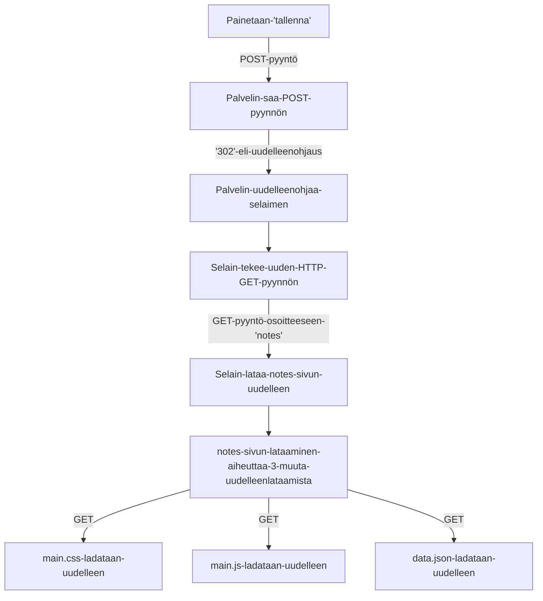

```mermaid
graph TD;
  Painetaan-'tallenna'--POST-pyyntö-->
  Palvelin-saa-POST-pyynnön--'302'-eli-uudelleenohjaus-->
  Palvelin-uudelleenohjaa-selaimen-->
  Selain-tekee-uuden-HTTP-GET-pyynnön--GET-pyyntö-osoitteeseen-'notes'-->
  Selain-lataa-notes-sivun-uudelleen-->
  notes-sivun-lataaminen-aiheuttaa-3-muuta-uudelleenlataamista--GET-->main.css-ladataan-uudelleen
  notes-sivun-lataaminen-aiheuttaa-3-muuta-uudelleenlataamista--GET-->main.js-ladataan-uudelleen
  notes-sivun-lataaminen-aiheuttaa-3-muuta-uudelleenlataamista--GET-->data.json-ladataan-uudelleen;
```
