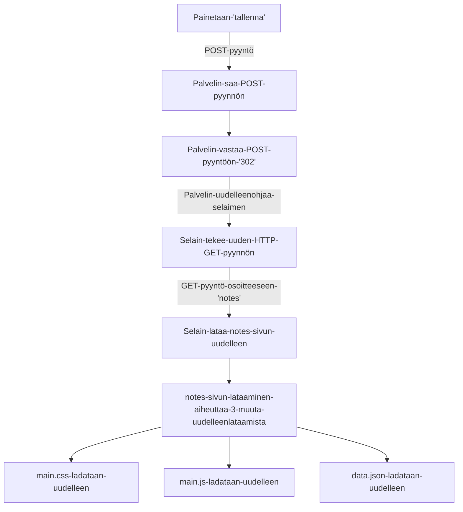

```mermaid
graph TD;
  Painetaan-'tallenna'--POST-pyyntö-->
  Palvelin-saa-POST-pyynnön-->
  Palvelin-vastaa-POST-pyyntöön-'302'--Palvelin-uudelleenohjaa-selaimen-->
  Selain-tekee-uuden-HTTP-GET-pyynnön--GET-pyyntö-osoitteeseen-'notes'-->
  Selain-lataa-notes-sivun-uudelleen-->
  notes-sivun-lataaminen-aiheuttaa-3-muuta-uudelleenlataamista-->main.css-ladataan-uudelleen
  notes-sivun-lataaminen-aiheuttaa-3-muuta-uudelleenlataamista-->main.js-ladataan-uudelleen
  notes-sivun-lataaminen-aiheuttaa-3-muuta-uudelleenlataamista-->data.json-ladataan-uudelleen;
```
