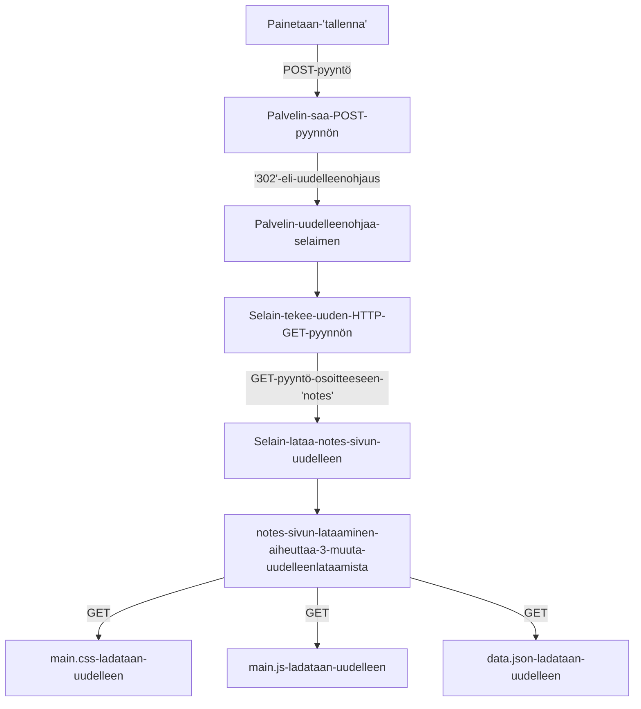
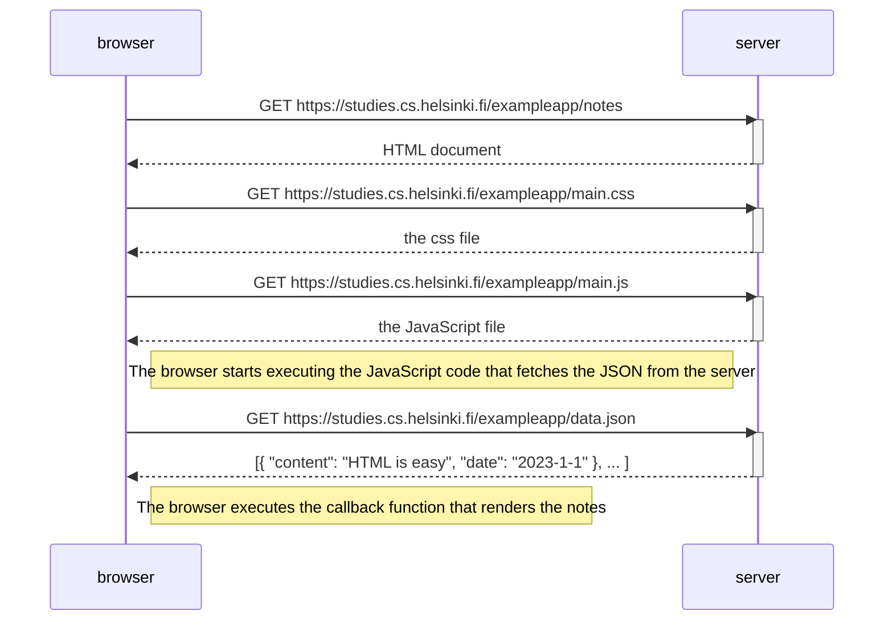
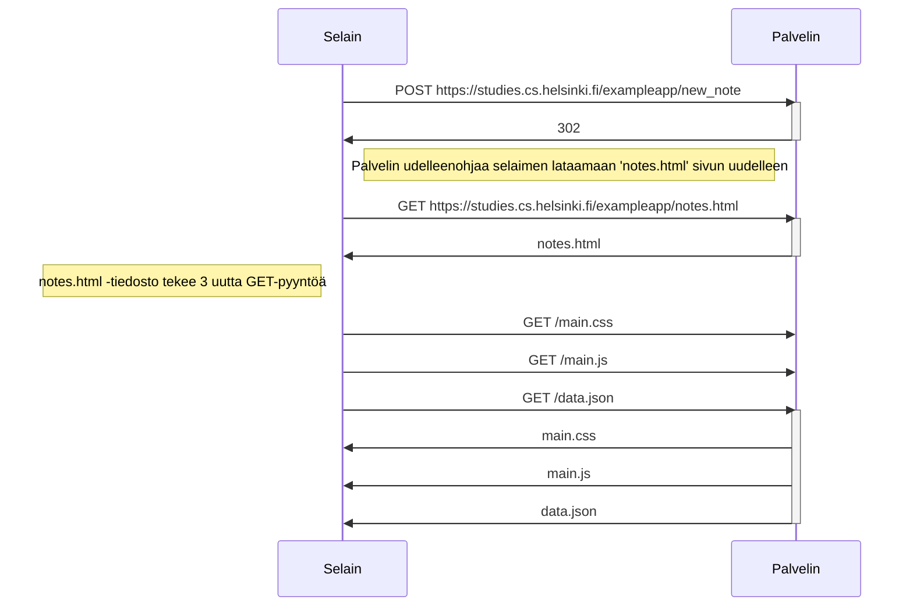

```mermaid
graph TD;
  Painetaan-'tallenna'--POST-pyyntö-->
  Palvelin-saa-POST-pyynnön--'302'-eli-uudelleenohjaus-->
  Palvelin-uudelleenohjaa-selaimen-->
  Selain-tekee-uuden-HTTP-GET-pyynnön--GET-pyyntö-osoitteeseen-'notes'-->
  Selain-lataa-notes-sivun-uudelleen-->
  notes-sivun-lataaminen-aiheuttaa-3-muuta-uudelleenlataamista--GET-->main.css-ladataan-uudelleen
  notes-sivun-lataaminen-aiheuttaa-3-muuta-uudelleenlataamista--GET-->main.js-ladataan-uudelleen
  notes-sivun-lataaminen-aiheuttaa-3-muuta-uudelleenlataamista--GET-->data.json-ladataan-uudelleen;
```

```mermaid
sequenceDiagram
    participant browser
    participant server
    
    browser->>server: GET https://studies.cs.helsinki.fi/exampleapp/notes
    activate server
    server-->>browser: HTML document
    deactivate server
    
    browser->>server: GET https://studies.cs.helsinki.fi/exampleapp/main.css
    activate server
    server-->>browser: the css file
    deactivate server
    
    browser->>server: GET https://studies.cs.helsinki.fi/exampleapp/main.js
    activate server
    server-->>browser: the JavaScript file
    deactivate server
    
    Note right of browser: The browser starts executing the JavaScript code that fetches the JSON from the server
    
    browser->>server: GET https://studies.cs.helsinki.fi/exampleapp/data.json
    activate server
    server-->>browser: [{ "content": "HTML is easy", "date": "2023-1-1" }, ... ]
    deactivate server    

    Note right of browser: The browser executes the callback function that renders the notes 
```

```mermaid
sequenceDiagram
  participant Selain
  participant Palvelin

  Selain->>Palvelin: POST https://studies.cs.helsinki.fi/exampleapp/new_note
  activate Palvelin
  Palvelin->>Selain: 302
  deactivate Palvelin

  Note right of Selain: Palvelin udelleenohjaa selaimen lataamaan 'notes.html' sivun uudelleen

  Selain->>Palvelin: GET https://studies.cs.helsinki.fi/exampleapp/notes.html
  activate Palvelin
  Palvelin->>Selain: notes.html
  deactivate Palvelin

  Note left of Selain: notes.html -tiedosto tekee 3 uutta GET-pyyntöä

  Selain->>Palvelin: GET /main.css
  Selain->>Palvelin: GET /main.js
  Selain->>Palvelin: GET /data.json
  activate Palvelin
  Palvelin->>Selain: main.css
  Palvelin->>Selain: main.js
  Palvelin->>Selain: data.json
  deactivate Palvelin
```
