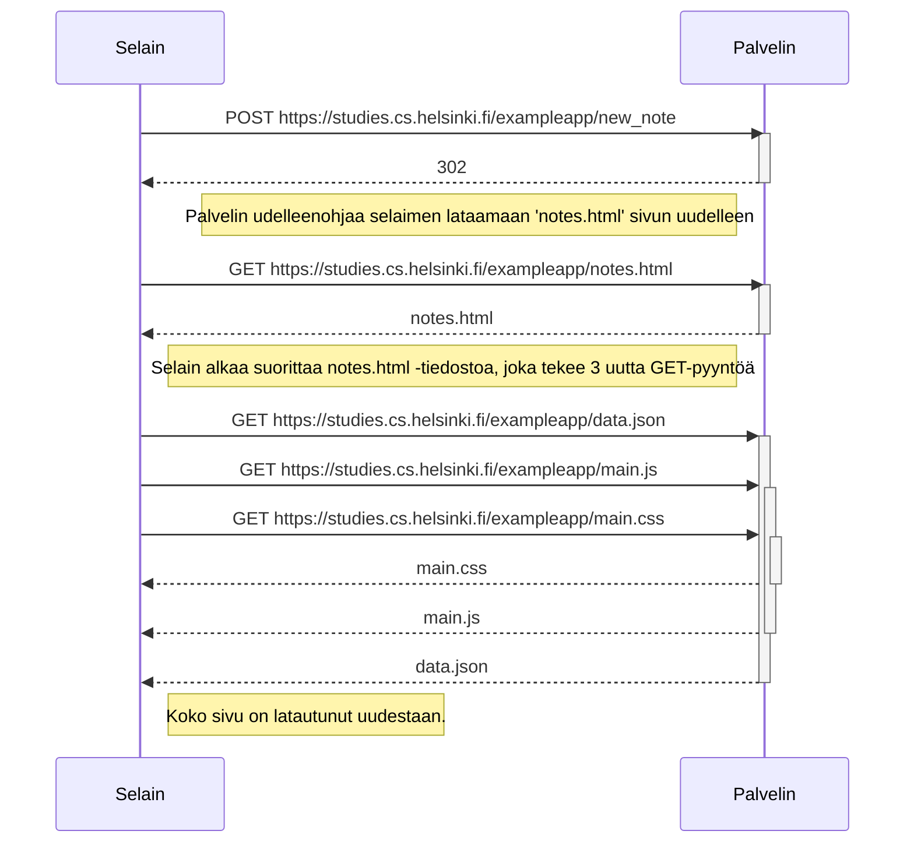

```mermaid
sequenceDiagram
  participant Selain
  participant Palvelin

  Selain->>Palvelin: POST https://studies.cs.helsinki.fi/exampleapp/new_note
  activate Palvelin
  Palvelin-->>Selain: 302
  deactivate Palvelin

  Note left of Palvelin: Palvelin udelleenohjaa selaimen lataamaan 'notes.html' sivun uudelleen

  Selain->>Palvelin: GET https://studies.cs.helsinki.fi/exampleapp/notes.html
  activate Palvelin
  Palvelin-->>Selain: notes.html
  deactivate Palvelin

  Note right of Selain: Selain alkaa suorittaa notes.html -tiedostoa, joka tekee 3 uutta GET-pyyntöä

  Selain->>+Palvelin: GET https://studies.cs.helsinki.fi/exampleapp/data.json
  Selain->>+Palvelin: GET https://studies.cs.helsinki.fi/exampleapp/main.js
  Selain->>+Palvelin: GET https://studies.cs.helsinki.fi/exampleapp/main.css
  Palvelin-->>-Selain: main.css
  Palvelin-->>-Selain: main.js
  Palvelin-->>-Selain: data.json

  Note right of Selain: Koko sivu on latautunut uudestaan.
```
