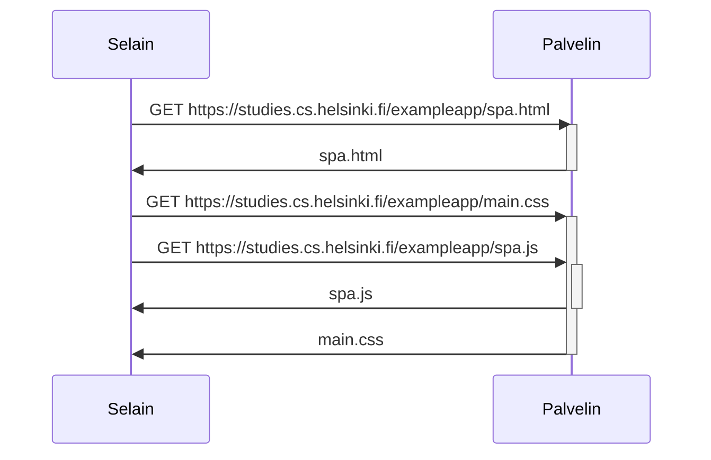

```mermaid
sequenceDiagram
  Participant S as Selain
  Participant P as Palvelin

  S->>P: GET https://studies.cs.helsinki.fi/exampleapp/spa.html
  activate P
  P->>S: spa.html
  deactivate P

  S->>+P: GET https://studies.cs.helsinki.fi/exampleapp/main.css
  S->>+P: GET https://studies.cs.helsinki.fi/exampleapp/spa.js
  P->>-S: spa.js
  P->>-S: main.css
```
