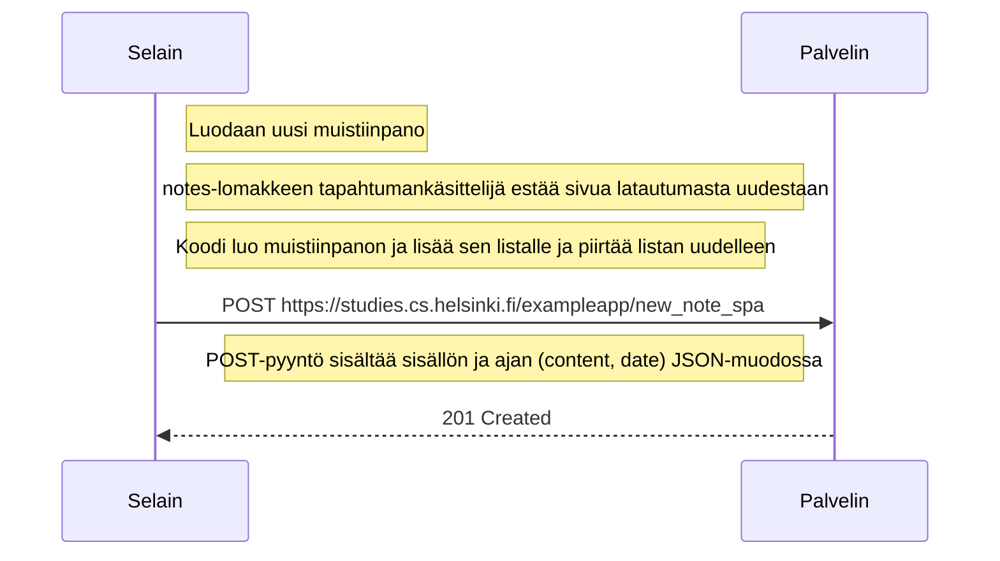

```mermaid
sequenceDiagram
  participant S as Selain
  participant P as Palvelin

  note right of S: Luodaan uusi muistiinpano
  note right of S: notes-lomakkeen tapahtumankäsittelijä estää sivua latautumasta uudestaan
  note right of S: Koodi luo muistiinpanon ja lisää sen listalle ja piirtää listan uudelleen

  S->>P: POST https://studies.cs.helsinki.fi/exampleapp/new_note_spa
  note left of P: POST-pyyntö sisältää sisällön ja ajan (content, date) JSON-muodossa
  P-->>S: 201 Created
```
